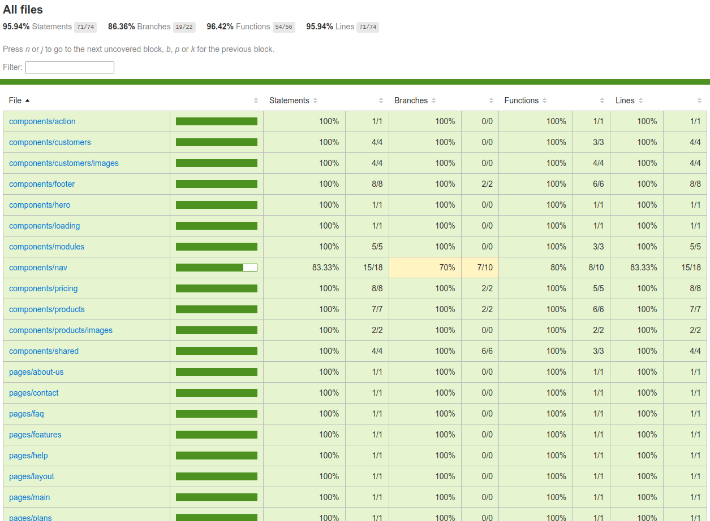

# PoCz Project Website

Development: 

<https://project-site.pocz.io>

Production: 

<https://www.animus.app.br>

## Tech

Created using React / TypeScript / Tailwind / Sequelize / PostgreSQL / Github Actions

### Description

- A basic product landing page to be used with all the projects created by PoCz. Designed to be easy to change and adjust to every project.

### Tests

#### Unit Tests - JEST / React Testing Library

`yarn test`

#### E2E Tests - Cypress

`yarn cypress:run` or `yarn cypress:open`

### CI/CD

Using GitHub Actions to run tests, build and send to AWS in the correct environment.

